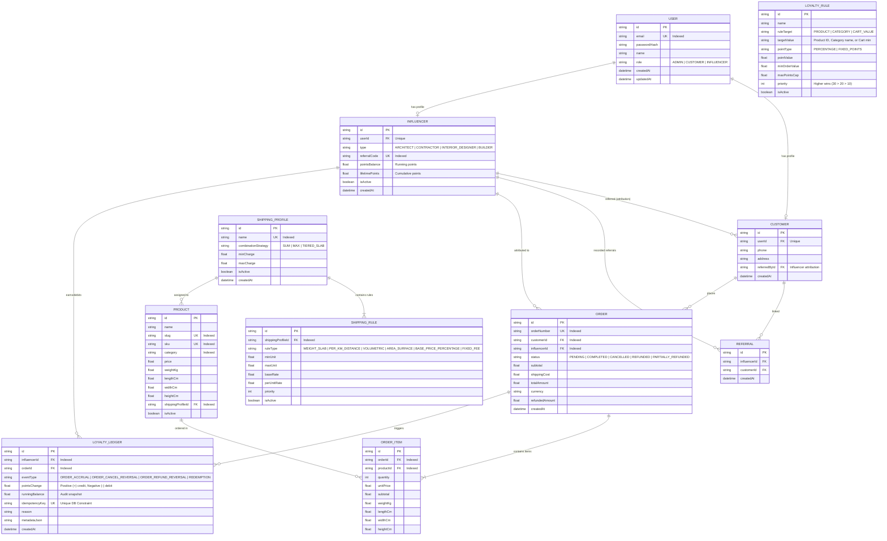

# Build8Now Database Architecture & ER Diagram

This document details the PostgreSQL / SQLite database design, schema relationships, foreign key constraints, justified indexes, and idempotency guarantees for Build8Now.

---

## 1. Entity-Relationship Diagram (Mermaid)

---

## 2. Key Constraints & Idempotency Design

1. **Unique Idempotency Constraint:**
   - Table `LoyaltyLedger` enforces a `UNIQUE` constraint on `idempotencyKey` and composite key `(orderId, eventType, idempotencyKey)`.
   - Any duplicate webhook or network replay immediately triggers an idempotent return or database unique-key rejection, guaranteeing that double points are mathematically impossible to award.

2. **Append-Only Immutable Ledger:**
   - Records in `LoyaltyLedger` are never updated or deleted.
   - Refunds and cancellations insert a negative debit entry (`pointsChange < 0`), preserving an unbroken financial audit trail.

3. **Justified Indexes:**
   - `User.email`: Fast O(1) login lookup.
   - `Product.slug`: Instant SEO URL matching on SSR product routes.
   - `Product.category`: Fast category filtering.
   - `Order.customerId` & `Order.influencerId`: Instant order history lookups.
   - `LoyaltyLedger(influencerId, createdAt)`: High-performance cursor pagination for transaction histories.
